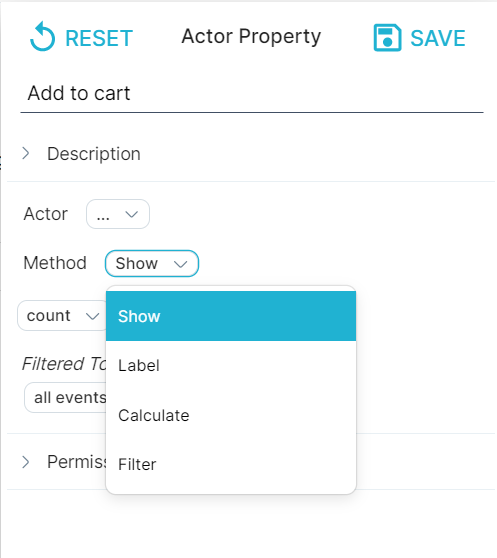
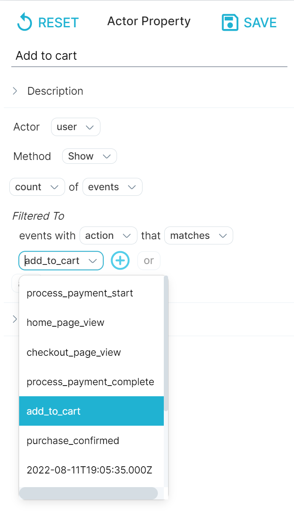
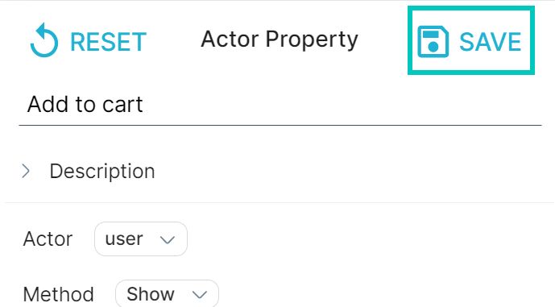

An actor is the someone or something that performs an event. In the context of an event, the actor refers to the entity responsible for its execution. This entity may take the form of a user, a physical object (such as a device), a digital object (like a service), or a bot.

Actor columns are specified during the data onboarding process. An actor is one of the mandatory fields for every logged event, along with a timestamp. You can associate a property with an actor using one of the following [methods](/measure_iq/glossary/method):

- **Show**: The most common actor properties aggregate events or flows. 
-   For example, an actor property of count number of sessions for sessions with total time >5 minutes.
- **Filter and label**: If you have several actor properties, you might want to perform a bucketing operation.
-   For example, if "Num5MinSessions > 10" then "heavy user" otherwise "light user". If you have a single if/then statement, use the Filter method. If you want to sort events into several buckets, create a case statement using the Label method.
- **Calculate**: You can perform a mathematical function and apply it as an actor property.
-   For example, if you have “Num5MinSessions” and “Num60MinSessions,” you can apply a function that returns a ratio of the two for the actor property.

## Defining an actor property

This section demonstrates how to create an [actor property](/measure_iq/glossary/journey-actor-user) using the Show method. In our example, we create an actor property that determines the add\_to\_cart events by each user. You can apply the principles from this example to create your own actor property.

#### **To create an actor property, do the following:**

1. Choose a dataset from the drop-down list at the top of the window. In this example, we chose the **hooli-infinity** dataset. The options available to you will reflect your data.
2. In the left menu bar, click **Data**. Click the **Drawer** icon in the upper right, then select the **Actor Property** icon.  
3. 
At the top, enter a unique **name** for the actor property, like **Add to cart**.
4. Select an actor from the drop-down list. The options available to you reflect your data.
5. Next to **Method**, select the method you want to use for your property. We accepted the default value of **Show**.  
6. 
Next to **Filtered To**, click **All events** to access the dropdown options. We selected **action**. The text automatically updates to **events with action** that **matches.**
7. Next to **matches**, click the box to access a dropdown with suggestions. We selected **add\_to\_cart.**
8. Hit **Save** in the upper right to save the newly created property.

## What's Next

You've successfully created an event property and actor property, now you'll want to learn how to:

- [Share an object or property with another user](../../scuba-guides/scuba-user-guides/manage-your-created-objects/share-an-object-with-other-users)
- [Create a flow](../scuba-tutorials/work-with-flows/create-a-flow)