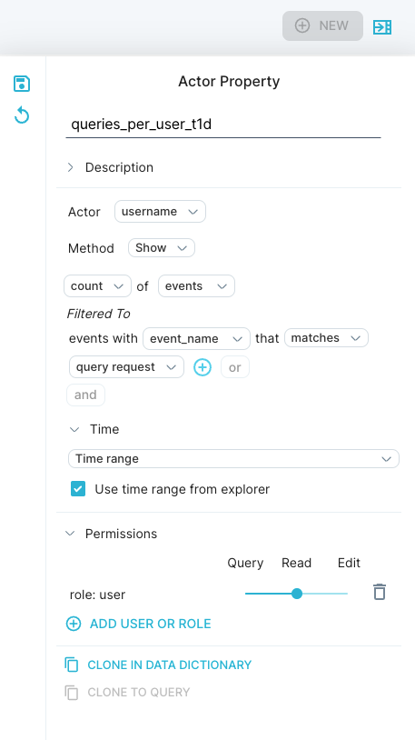
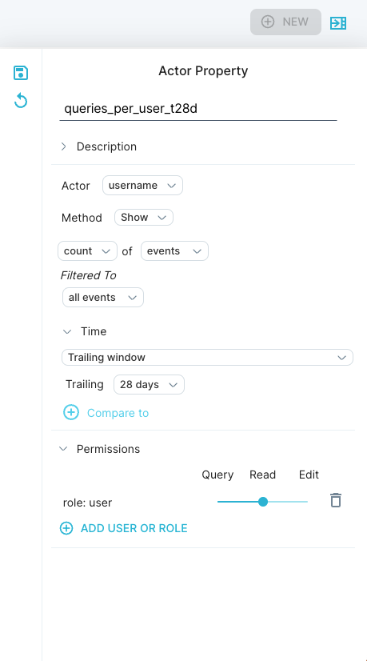
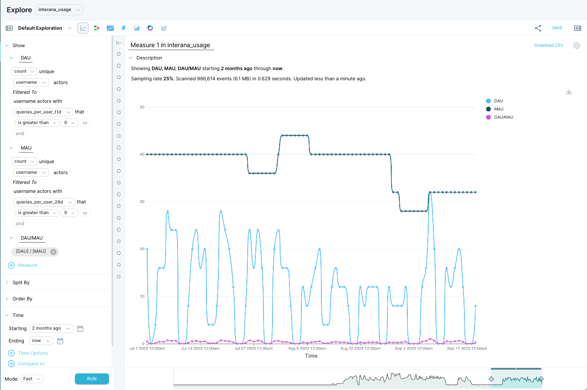
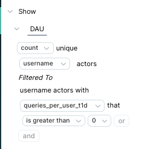
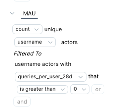
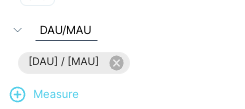
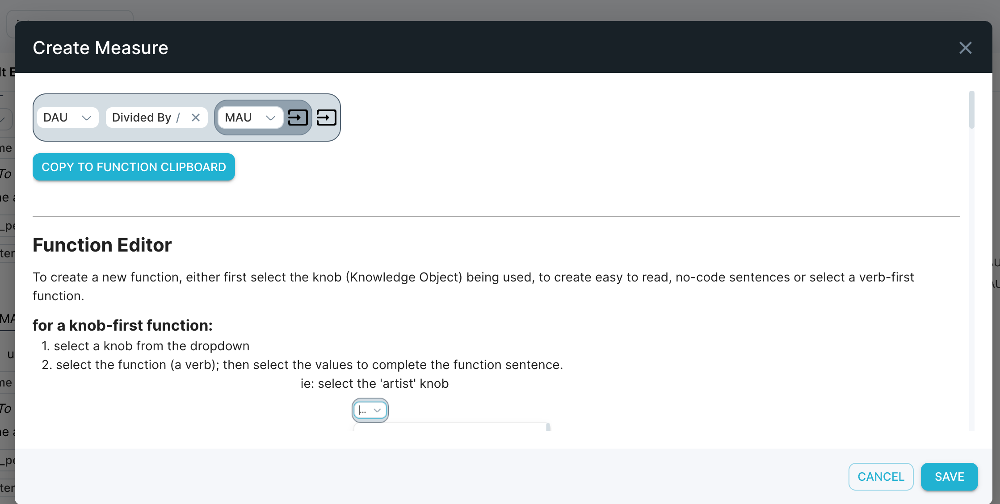

One way to evaluate your app’s “stickiness” is to compare its daily active users (DAU) and monthly active users (MAU). 

The ratio of DAU/MAU represents your average daily active user count/monthly active user count. The closer your ratio is to 1, the more often users are using your app, rather than logging in only sporadically. 

This article demonstrates the following:

1. How to build custom [actor properties](/measure_iq/glossary/journey-actor-user) for daily active users and monthly active users.
2. How to analyze the actor properties in Explore.

This article uses the Scuba loopback usage data set.

## Build the custom actor properties

To analyze DAU/MAU, create two custom actor properties:

- One that measures daily activity
- One that measures monthly activity

Define daily activity and monthly activity using the same criteria except for the trailing time window.

You can create an actor property in one of two ways:

- In the **Data Dictionary**, by utilizing the +New button in the upper right corner.
- In the **Data Drawer**, by clicking the drawer button in the upper right corner.

#### To build a Daily Activity actor property, do the following: 

1. In the left menu bar, click **Data**, then click the **+New** button in the upper right-hand corner.
2. Select **Actor Property** from the drop-down down.
3. Enter a name for the property. We named our property **queries\_per\_user\_t1d** to help someone look at this query later to quickly see what criteria we use to measure daily activity (see step 7).
4. In the definition pane, select an actor (or use the default). In our example, we selected **username**.
5. Accept the default [method](/measure_iq/glossary/method), **Show**, and the default aggregation, **count** of **events**.
6. At **Filtered to**, click **all events**. From the dropdown, select the event property or combination of event properties that define a user action. In our example we selected **event\_name**. 
7. In the new dropdown, select the **event\_name** you want to filter to. For our example, we chose only one action, **query request**.  
*For our usage loopback table data, we consider a user to be “active” if they run at least one query. This is why we filter our actor property to **event\_name** matches **query request**.*
8. Click **\+ time options** and accept the default of “Trailing window: trailing 1 day”. See [Specify time in a query](../../../scuba-guides/scuba-user-guides/build-queries-and-visualizations/specify-time-in-a-query) for more information about trailing windows.
9. Set Permissions if you intend on sharing the property with others.
10. Click the **Save icon** in the upper left-hand corner.

#### **To build a Monthly Activity actor property, do the following:** 

1. In the left menu bar, click **Data**, click the **New** button, then select **Actor Property** from the drop-down.
2. At the top of the page, enter a name for the property. We named our property **queries\_per\_user\_t28d** to help someone looking at this query later to quickly see the criteria (queries per user) and time range (28 days) we're using to define monthly activity.
3. If you duplicated the daily activity actor property, you can accept the settings at Method, Show, and Filtered to. These correspond to steps 4-7 above.
4. Click **\+ time options**.
5. Next to Trailing, click **1 day** to open the dropdown. Type `28` and select 28 days. In our example, we use 28 days instead of 1 month, because 28 days has a consistent number of weekend and weekday days, regardless of starting date.
6. Set Permissions.  

7. Click **Save** to save the actor property.

## Construct the top-level query

To compare DAU and MAU, build a query in Explore. For example, your end goal might be something like this:

#### To create a query with DAU and MAU on the same chart:

1. Navigate to the daily activity actor property (called **queries\_per\_user\_t1d** in our example).
2. From the daily activity actor property, click Explore at the top left.
3. Click **measure 1** and edit the name to DAU.
4. Under Filtered to, click **all username actors** (or whatever your actor field is named) and select your daily activity actor property from the dropdown. For our example (where our daily activity property is named **queries\_per\_user\_t1d**), the text automatically updates to read **Filtered to username actors with queries\_per\_user\_t1d that is greater than 0**. Change the minimum criteria to suit your analysis needs.  

5. Click **+measure** to start creating the MAU definition.
6. Click **measure 2** and edit the name to MAU.
7. Repeat the selections from the DAU measure above, substituting your monthly activity actor property in place of your daily activity actor property. In our example, our monthly activity actor property is called **queries\_per\_user\_t28d**.  

8. Optional: To calculate DAU/MAU:  

  

1.   Click **+measure** to add a measure 3. Name it `DAU/MAU`.
2.   Click **count** and select **Create a Function** from the drop-down.
3.   Select **DAU** from the drop-down
4.   Select **Divided by** from the next dropdown.
5.   Select **MAU** from the next drop-down
6.   Click **Save** from the bottom right corner.
9. Click **Run** to run the query.
10. Click **Save** at the top right to save the query for future use.