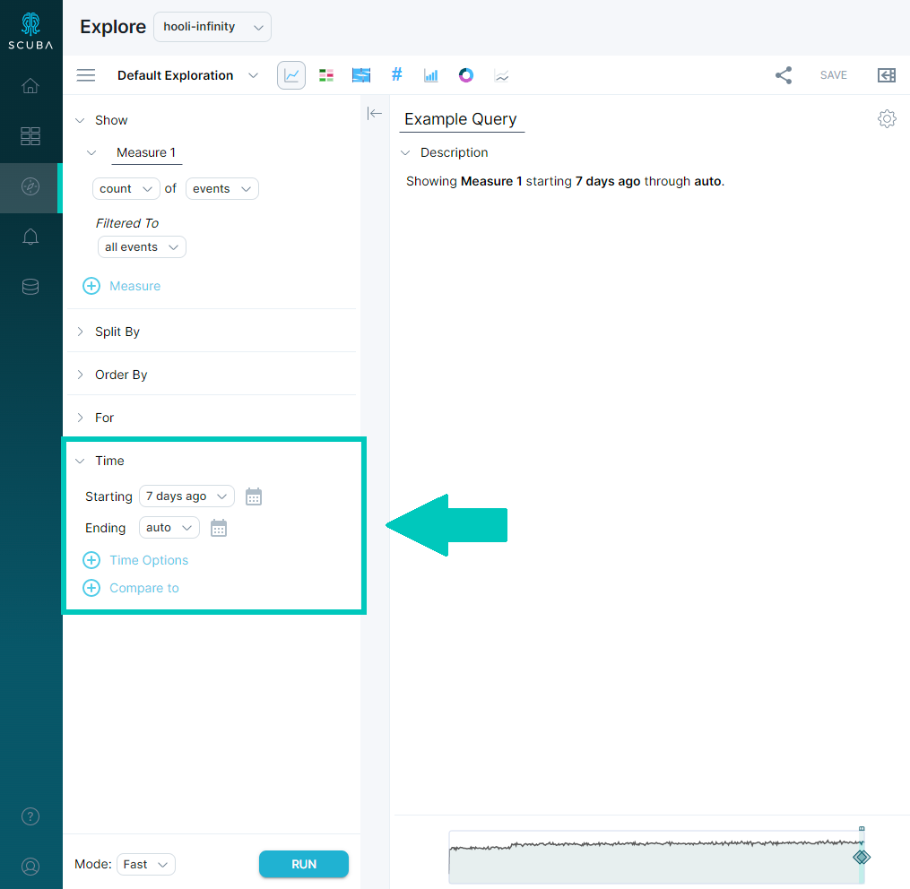
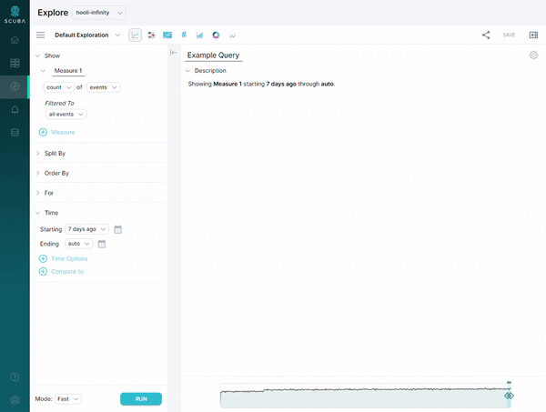
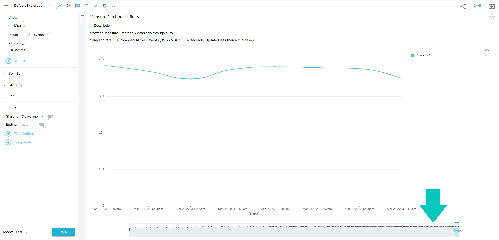
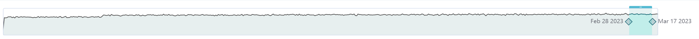
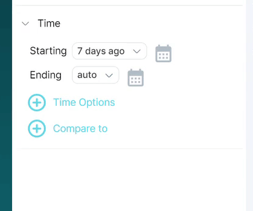

In many of your queries, you may want to specify a time range other than the default setting. This article explains how to use time settings in a query, and explains how Scuba handles relative time.

## Using time settings in a query

When you build a query in Explore, you will need to specify start and end times. When creating queries in Time view, you can also set the time resolution and trailing window.

## Specify start and end times

This section outlines the various ways you can specify start and end times.

- In the query definition, next to **Starting**, click the value and select from the drop-down menu, or type any value. Do the same for **Ending**.
- In the query definition, on the end of the line with **Starting**, click the calendar icon. Select a day, then specify hours, minutes, and seconds by clicking the respective up and down arrows. Click **Apply** when finished to apply the time range to the query.  
- 
- At the bottom of the Explore window, use the [time scrubber](/measure_iq/glossary/time-scrubber) to pick a range. The time scrubber is a visual equivalent of the starting and ending times in the query definition, and as you adjust either the query definition or the time scrubber, the other updates to reflect the change. The time scrubber rounds the start and end values to the nearest 15 minutes, if the selected time range is less than 48 hours. If you scrub beyond 48 hours, the start and end values snap to the start and end of the selected days.

## Set the time resolution and trailing window

You can specify the time resolution of the data points plotted on the Time view graph, as well as setting the [trailing window](/measure_iq/glossary/trailing-window) over which the data points are scanned. These settings determine the granularity of events for the query.

### To set the time resolution and trailing window, do the following:

1. In the query definition, below the starting and ending times, click the plus sign next to **Time Options**. Default options, which are determined by your starting and ending time range, will display initially. Scuba chooses auto default time options for time resolution and trailing window based on the time range you choose. For longer time ranges, Scuba chooses larger units of time resolution.  

2. To set the time resolution, click the first **auto** option and choose from the dropdown list. The trailing window changes to match your selection.
3. To specify a different trailing window, choose from the **trailing** dropdown list, or type a new interval.
4. Click **Run** to run the query and view the results.
5. Validate your trailing window in the results pane by mousing over two adjacent data points and comparing their time ranges.

### Using time ranges and trailing windows in an actor property:

You can set a trailing window or time range for an actor property, in addition to setting one in the top-level query. If the trailing window for an actor property differs from that specified for the top-level query, the actor property trailing window applies for the calculation of the actor property value.

**Trailing windows** in an actor property will always be relative to the time range specified in your Explore query.

If your query’s time range is “2021-08-01 00:00 UTC to 2021-08-07 24:00 UTC” and your actor property has a trailing window of 7 days, then the actor property value will be calculated based on the 7 days prior to the query’s starting and ending times (2021-07-025 00:00 UTC to 2021-07-31 24:00 UTC).

**Time ranges** used in actor properties can be *relative* or *absolute* (see below for more details on relative time), but *neither* will be affected by the starting and ending times in your Explore query.

When you specify a time range with relative time, such as “7 days ago to now”, the actor property output will be calculated relative to **NOW**, the time you run the query.

When you specify an absolute time range, such as “2021-08-01 00:00 UTC to 2021-08-31 24:00 UTC”, your actor property output will always be calculated over that time period.

## How Scuba handles relative time

You can specify absolute time or relative time in a query. The following sections describe settings for relative time.

### Relative values

When you construct a query, you specify the time over which the query will scan for results by choosing intervals from drop-down menus or entering custom values. The sentence model query builder allows you to specify non-uniform intervals, such as year, month, and calendar quarter, as well as uniform intervals such as seconds, minutes, hours, and days.

The following table summarizes the delimiters used with non-uniform time intervals.

| Time interval | Relative value |
| --- | --- |
| Beginning of time | Start of first event |
| Now | Current time |
| Yesterday | Preceding day |
| This  - Hour - Day - Week - Month - Year | The current  - Hour - Day—00:00:00 to 23:59:59 - Week—Sunday 00:00:00 to Now - Month  - Year |
| Previous  - Hour - Day - Week - Month - Year | Ago  - Hour - Day - Week - Month - Year |

### Snapping behavior

You can specify an exact time to “snap” to in the Explorer time windows, for example by typing **12:12:42 exactly** in the time field. If you do not specify a custom snap time, the following defaults are used.

| Time interval | Snap default |
| --- | --- |
| Minutes | Are exact |
| Hours | Start at the top of the hour |
| Days | Start at 00:00:00 |
| Weeks | Start on Sunday at 00:00:00 |
| Months | Start on the 1st at 00:00:00 |
| Calendar quarters | Start on  - 1/1 at 00:00:00 - 4/1 at 00:00:00 - 7/1 at 00:00:00 - 10/1 at 00:00:00 |
| Years | Start on 1/1 at 00:00:00 |

For example, if your time range is specified as 4 weeks, by default Scuba snaps to the beginning of the week (Sunday at midnight). In contrast, if you specify 28 days, Scuba snaps to today at midnight.

## What's Next

Now that you know how to create basic queries and flows, and how to specify relative time, try these procedures:

- [Determine a ratio](../../../scuba-guides/scuba-tutorials/work-with-queries/determine-a-ratio)
- [Analyze user sessions with flows](../../scuba-user-guides/analyze-user-paths-with-flows/example-analyze-user-sessions-with-flows)