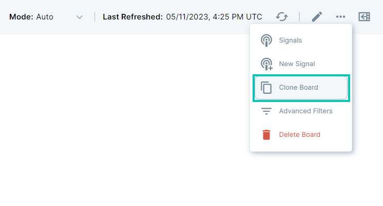
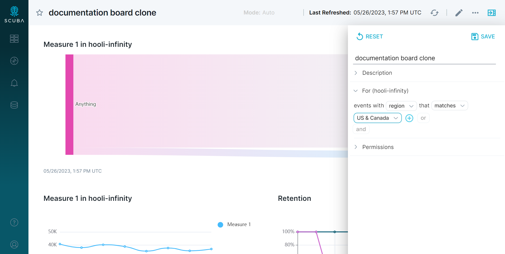

You might have a board with reports about operational data, and you'd like to display the exact same data in different geographic regions, or filtered by some other segment.

You can accomplish this by creating a board with all of the information you're interested in, duplicating the board, creating a board filter on the copied board for the first region of interest, saving the board, and repeating for other regions of interest.

## Create filtered boards

To create multiple boards for different regions:

1. Create a board with all of the information you're interested in. For example, if you intend to filter by region, this original board should include the data from all regions.
2. From the board, click the ellipsis icon in the board menu in the upper right, then select **Clone Board**.
3. Name the new board and add an optional description, then click **Save**.
4. On the new board, create a board filter for the first region of interest, say North America, as follows:
5. On the new board, click the drawer icon in the upper right-hand of the screen. Expand the pre-filter by clicking on **For**.
6. Define your filter.
7. If you want to share the board with certain users, add the permissions.
8. Click **Save**. Now the filter persists, and you can share your board with its saved filter.
9. Duplicate the original board again (not the new copy), and repeat steps 3 and 4 for other regions of interest.

### About saved board filters

Every query on the board is run with this filter appended to its list of prefilters. See [Add a prefilter to your query](../add-a-global-pre-filter-to-your-query) for more information about prefilters.

From a board, to view the saved board filters, open the drawer by clicking the icon in the upper right.

#### Working with a panel with a saved board filter

To remove the board filter and work with the unfiltered query, click **Explore** to open the query in Explore, then delete it under **For**.

#### Duplicating a panel with a saved board filter

If you duplicate a board or panel that has a saved filter, the saved filter persists.

If you pin a duplicated panel to a new board that also has a filter, the old and new filters apply.
